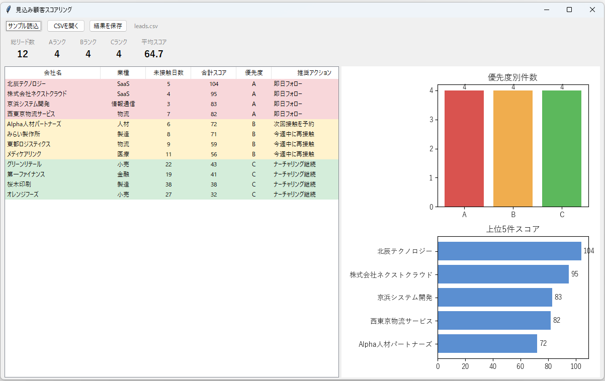

# 01 見込み顧客スコアリング

問い合わせ回数、資料DL数、業種、企業規模、最終接触日からリード優先度を A/B/C に分類する。

- 起動: `cd 01_lead_scoring_workbench` → `../.venv-linux/bin/python gui.py`
- 入力: `data/leads.csv`
- 出力: `results/lead_priority.csv`
- 見せ場: 優先度別件数と上位リード一覧

