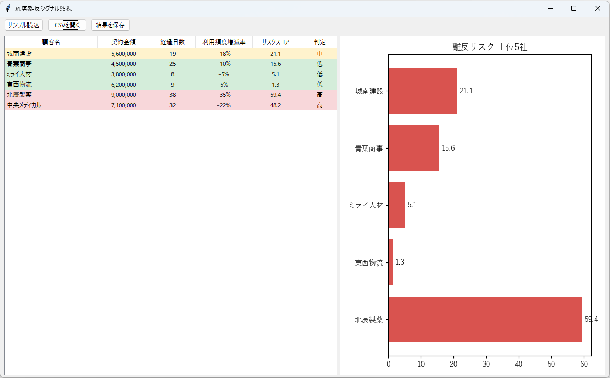

# 06 顧客離反シグナル監視

最終受注日、利用低下、問い合わせ減少、クレーム有無から離反リスクをスコア化する。

- 起動: `cd 06_customer_churn_signal_monitor` → `../.venv-linux/bin/python gui.py`
- 入力: `data/customers.csv`
- 出力: `results/churn_alerts.csv`

