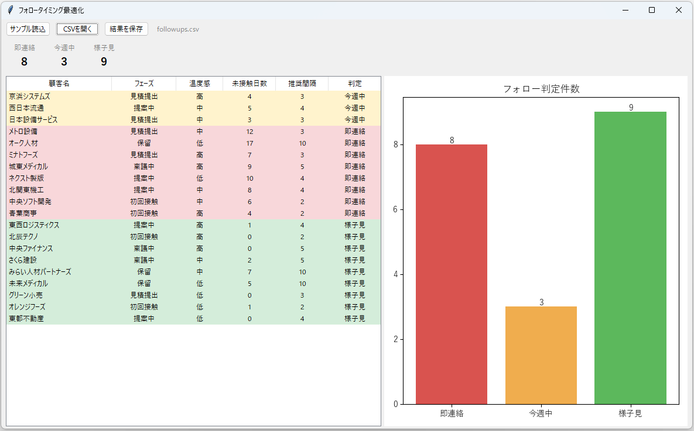
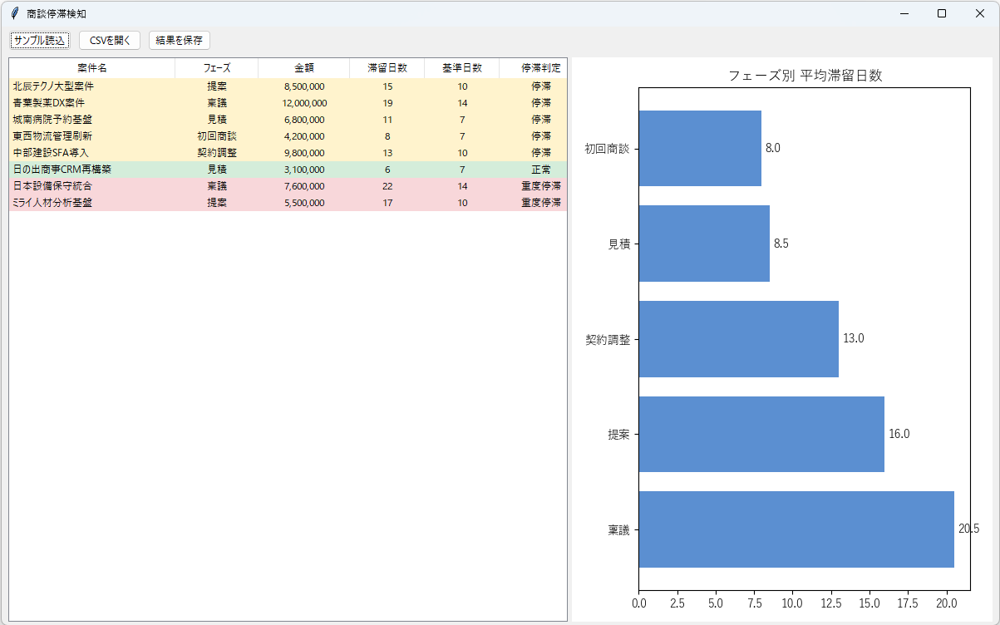
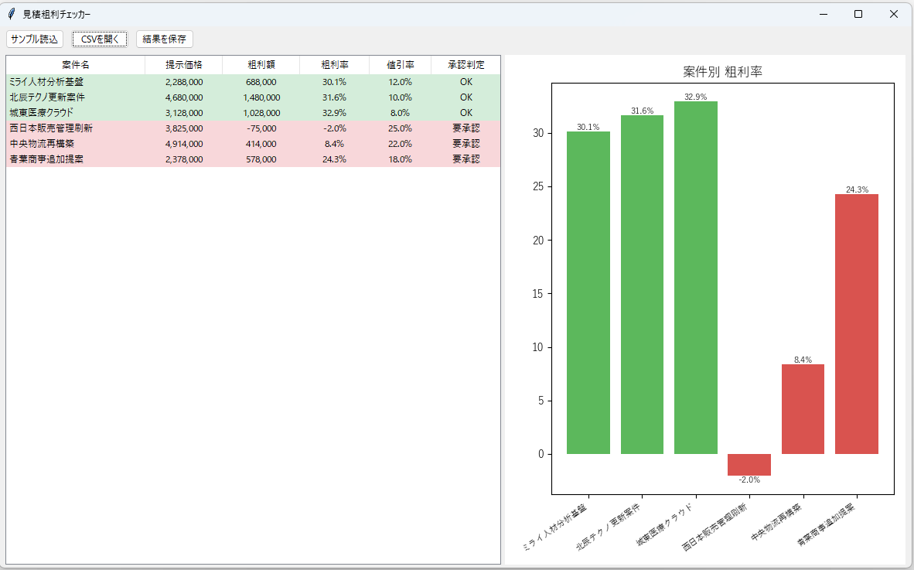
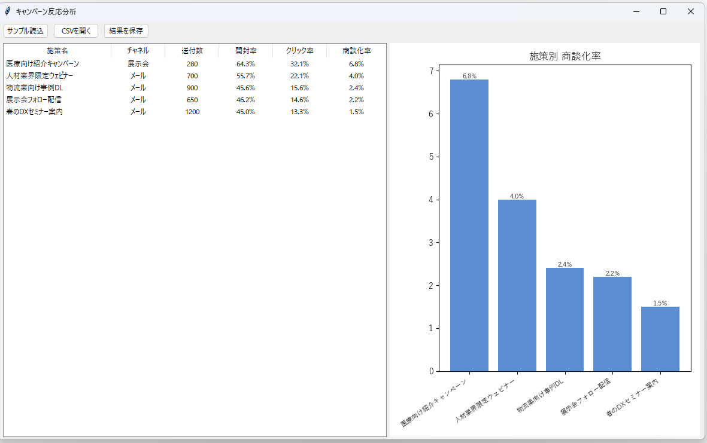
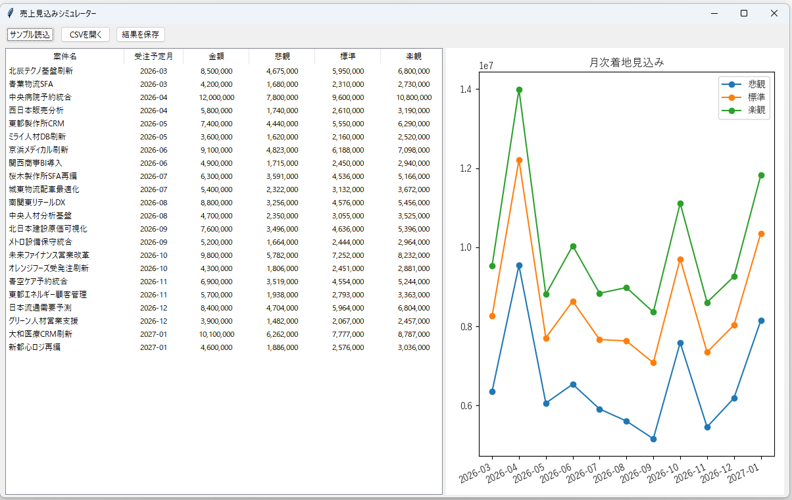
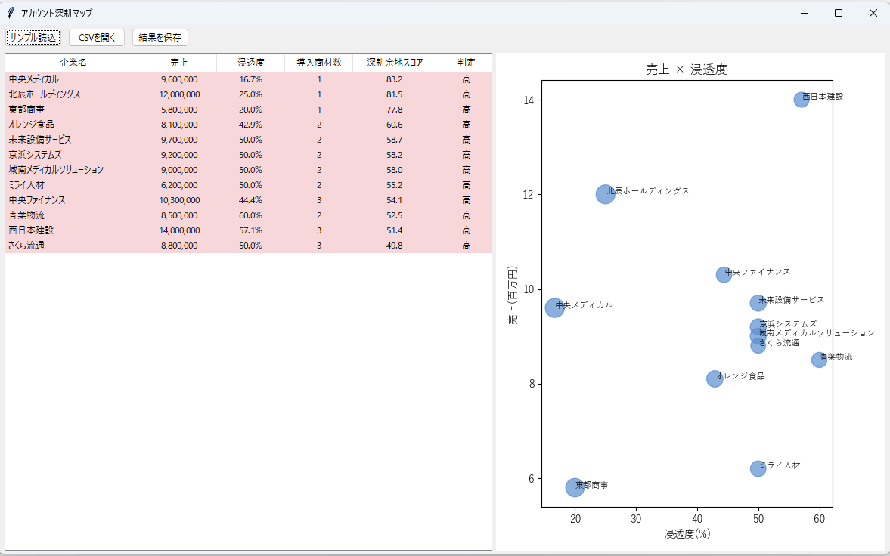
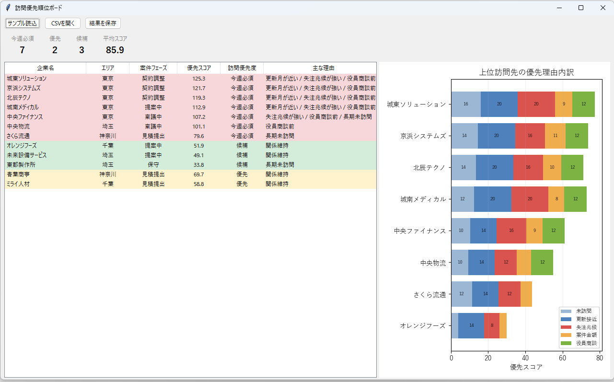

# Python Sales Support デモアプリ集

営業支援の現場で説明しやすい題材に寄せた Tkinter デスクトップアプリ 10 本です。

各アプリは `main.py` に分析ロジック、`gui.py` に Tkinter UI を分離しています。

## 環境セットアップ

```powershell
uv venv .venv-linux --python 3.14
uv pip install --python .venv-linux/bin/python -r requirements.txt
```

## 起動方法

```powershell
cd 01_lead_scoring_workbench
../.venv-linux/bin/python gui.py
```

## アプリ一覧

### 01 見込み顧客スコアリング


### 02 フォロータイミング最適化


### 03 商談停滞検知


### 04 見積粗利チェッカー


### 05 営業活動量トラッカー


### 06 顧客離反シグナル監視


### 07 キャンペーン反応分析


### 08 売上見込みシミュレーター


### 09 アカウント深耕マップ


### 10 訪問優先順位ボード


